# Atividade de Linux - PB JUN 2025

## Introdução

Nesse projeto, eu (Arthur Guimarães Elleres) pude aprender como fazer uma instância EC2 e configurar uma VPC dentro da AWS. Além disso, tive que configurar um servidor Nginx e alguns serviços para monitorar o funcionamento do servidor. Também foi necessário configurar um bot para enviar mensagens para o meu próprio número quando o serviço do Nginx parasse de funcionar, por qualquer motivo que seja.

## Etapa 1

Para criar uma rede VPC dentro da AWS, utilizei a interface gráfica da AWS, que exige poucos passos para configurar a VPC e as configurações são bem claras. Portanto, o processo foi bem simples.

*Figura 1: Criação de VPC*

Depois de criar a VPC, passei para a parte de criar uma instância EC2, que também é bem simples, visto que a interface da AWS possui bastante clareza. A parte mais importante foi colocar as **tags de forma apropriada** (conforme a Patrícia instruiu), definir a imagem do sistema operacional e selecionar a VPC (com uma sub-rede pública que foi configurada anteriormente) correta. Além disso, foi necessário ajustar algumas regras de segurança para permitir a conexão por meio de SSH (porta 22) e solicitações HTTP (porta 80).

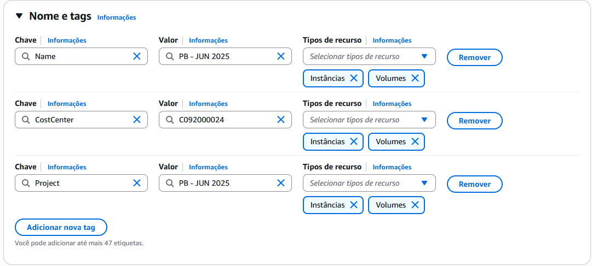
*Figura 2: Tags na criação da instância ECS*

Apesar de ter baixado a chave de acesso SSH, não tentei utilizar o SSH diretamente da minha máquina, visto que no painel de administração da AWS existe a possibilidade de conectar diretamente pelo navegador.

## Etapa 2

### Instalando Nginx

Após configurar a instância EC2, precisei instalar o Nginx. Para isso, utilizei o [tutorial](https://nginx.org/en/linux_packages.html#Ubuntu) que está disponível na documentação oficial do Nginx.

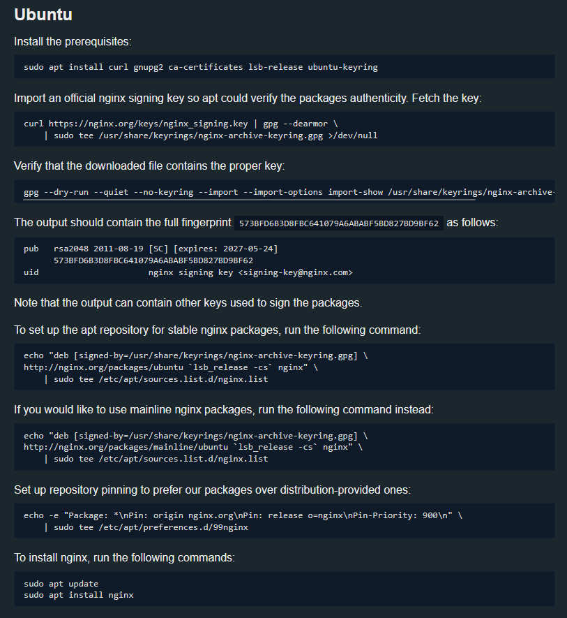
*Figura 3: Instalação do Nginx de acordo com documentação oficial.*

### Configurando Nginx

Depois de executar os comandos acima, o Nginx estava disponível na minha instância. Entretanto, para que ele servisse a página HTML conforme o esperado, precisei fazer alterações nas configurações do serviço.

Primeiramente, deletei o arquivo **/etc/nginx/conf.d/default.conf** para que não houvesse conflitos com o meu arquivo de configuração. Após a deleção, criei um novo arquivo chamado **site_inicial.conf** (na mesma pasta onde estava o default.conf) e segui as configurações que estão na documentação oficial do software. Fiz algumas alterações para que a página fosse servida da seguinte forma: ao acessar **http://IP_DA_MAQUINA/index.html**, o arquivo seria enviado corretamente. Esse método, na verdade, permite que todos os arquivos que estão na pasta **/data/www/** sejam acessados por meio da URL, portanto, somente arquivos públicos devem ficar nessa pasta.

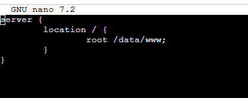

*Figura 4: Configuração do arquivo /etc/nginx/conf.d/site_inicial.conf*

É importante ressaltar a importância de **alterar as permissões da pasta `/data/www`**. Se o usuário usado pelo nginx (`www-data`) não tiver permissão para ler os arquivos na pasta, ele não poderá servir da forma apropriada. Portanto, foi necessário executar os comandos:
**`sudo chown -R www-data:www-data /data/`**
**`sudo chmod -R 755 /data/`**

### Criação do serviço

Para configurar o Nginx para reiniciar quando ele parasse, foi recomendado criar um novo serviço. Entretanto, descobri que não era necessário criar um serviço do zero. Era possível alcançar o mesmo resultado utilizando o comando **`sudo systemctl edit nginx`**. Esse comando abre um editor de texto em um arquivo que irá sobrescrever algumas configurações do Nginx padrão. Dessa forma, podemos adicionar um bloco (bloco `[Service]` que não está comentado na **Figura 5**) de código que ordene a reinicialização do Nginx quando ele parar.

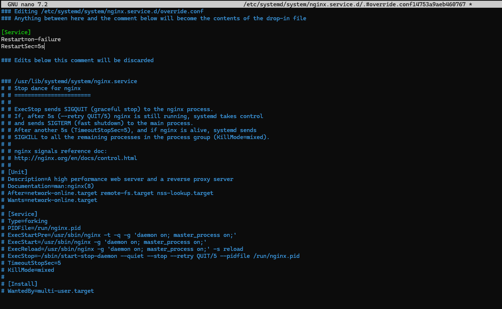
*Figura 5: Resultado de systemctl edit nginx, com configurações para reinicialização.*

## Etapa 3

### Script para enviar mensagem pelo Telegram

Primeiramente, criei um script para enviar mensagem para o meu número utilizando o Telegram. Para isso, enviei uma mensagem para o BotFather no Telegram.

*Figura 6: Criação do bot com o BotFather*

Após o diálogo da **Figura 6**, recebi um token (que não exibi na imagem por motivos óbvios) que poderia utilizar para executar comandos no bot que criei. Com o token em mãos, agora é possível criar um script para enviar uma mensagem. Para evitar expor os segredos no código `.sh`, criei um arquivo `.env` e coloquei o token e a URL que eu utilizei para fazer a requisição.

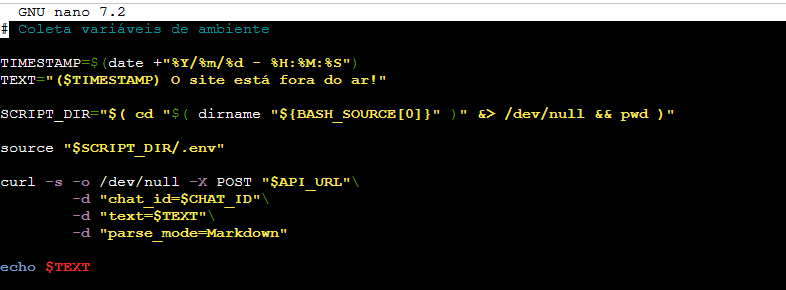
*Figura 7: O script send-message.sh*

O script é bem simples, vou explicar linha por linha.

#### `TIMESTAMP=$(date +"%Y/%m/%d - %H:%M:%S")`

**`TIMESTAMP=$(date +"%Y/%m/%d - %H:%M:%S")`** -> Cria uma variável `TIMESTAMP` e armazena o valor da expressão após o sinal de igualdade.
`TIMESTAMP=`**`$(date +"%Y/%m/%d - %H:%M:%S")`** -> O cifrão seguido de parênteses significa que o valor de saída da função de dentro dos parênteses será substituído e, portanto, atribuído à variável.
`TIMESTAMP=$(**date +"%Y/%m/%d - %H:%M:%S"**)` -> Função para retornar o horário atual, formatado conforme está dentro da string, sendo o resultado: Ano/Mês/Dia - Hora:Minuto:Segundos.

#### `TEXT="($TIMESTAMP) $TEXT"`

**`TEXT="($TIMESTAMP) $TEXT"`** -> Não vou entrar em tantos detalhes pois é uma linha simples. Ele vai coletar o valor de **TIMESTAMP** e inserir no começo da string. Após isso, vai atribuir essa string à variável **TEXT**.

#### `SCRIPT_DIR="$( cd "$( dirname "${BASH_SOURCE[0]}" )" &> /dev/null && pwd)"`

`SCRIPT_DIR="$(cd "$( dirname **"${BASH_SOURCE[0]}"** )" &> /dev/null && pwd)"` -> Esse comando exibe onde está sendo executado um script, nesse caso, onde o script `send-message.sh` está.

`SCRIPT_DIR="$(cd "$( **dirname** "${BASH_SOURCE[0]}" )" &> /dev/null && pwd)"` -> Serve para extrair o diretório de um caminho. Por exemplo, se eu executasse: **`dirname "/home/ubuntu/verificar-disponibilidade.sh"`** resultaria em `/home/ubuntu` sendo printado no terminal.

`SCRIPT_DIR="$(**cd** "$( dirname "${BASH_SOURCE[0]}" )" **&> /dev/null** && pwd)"` -> O `cd` será executado com o texto resultante do `dirname`, ou seja, o diretório onde está sendo executado o `send-message.sh`. O **`&>/dev/null`** serve para "jogar fora" qualquer output que o `cd` possa exibir.

`SCRIPT_DIR="$(cd "$( dirname "${BASH_SOURCE[0]}" )" &> /dev/null **&& pwd**)"` -> Vai executar o `pwd` somente se o `cd` tiver executado com sucesso. Retornando o diretório onde o código está sendo executado.
`SCRIPT_DIR=**"$(**cd "$( dirname "${BASH_SOURCE[0]}" )" &> /dev/null && pwd**)"**` -> Coleta o resultado dos comandos e salva na variável `SCRIPT_DIR`.

#### `source "$SCRIPT_DIR/.env"`

**`source "$SCRIPT_DIR/.env"`** -> Importa do arquivo `.env` do diretório onde o script está sendo executado.

#### `curl -s -X POST "$API_URL" -d "chat_id=$CHAT_ID" -d "text=$TEXT" -d "parse_mode=Markdown"`

**`curl -s -X POST "$API_URL"`**\\
`-d "chat_id=$CHAT_ID"`\\
`-d "text=$TEXT"`\\
`-d "parse_mode=Markdown"` -> Faz uma post request para `$API_URL` (que está sendo importada do arquivo `.env`) de forma silenciosa (sem poluição no terminal).

`curl -s -X POST "$API_URL"`\\
**`-d "chat_id=$CHAT_ID"`**\\
**`-d "text=$TEXT"`**\\
**`-d "parse_mode=Markdown"`** -> Parâmetros da [API do Telegram](https://core.telegram.org/bots/api#sendmessage). `chat_id` representa o ID da conversa (basicamente quem deve receber a mensagem), `text` é o texto da mensagem (nesse caso, a variável que criamos acima) e por último, `parse_mode` é o modo que a API deve ler o texto enviado, nesse caso, selecionamos como `Markdown`, já que é um texto simples.

Com isso, tenho um bot capaz de enviar mensagens ao meu Telegram quando necessário. Para executá-lo, basta usar o caminho absoluto do arquivo, nesse caso é **"/home/ubuntu/telegram-bot/send-message.sh"**.

### Script de monitoramento da página Nginx

Para monitorar a página, fiz um script que envia uma post request para a URL **`http://127.0.0.1/index.html`**. Dependendo do código da resposta, é possível dizer se o sistema está funcionando conforme o esperado.

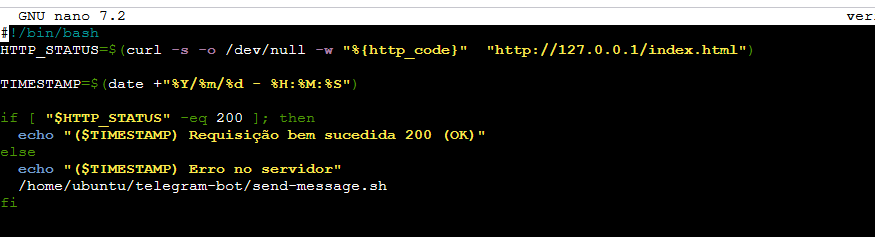

*Figura 8: Script verificar-disponibilidade.sh*

`HTTP_STATUS=$(curl **-s -o /dev/null** -w "%{http_code}" "http://127.0.0.1/index.html")` -> A flag **`-s`** representa uma saída silenciosa (sem printar no terminal mensagens de erro). Enquanto a flag e o parâmetro **`-o /dev/null`** representam que a saída (corpo da resposta) vai ser salva em `/dev/null`, que é um arquivo que descarta qualquer coisa que for escrita nele.

`HTTP_STATUS=$(curl -s -o /dev/null **-w "%{http_code}" "http://127.0.0.1/index.html"**)` -> A flag **`-w "%{http_code}"`** essencialmente coleta a variável `http_code` (isso pode ser visto na documentação do curl com "man curl"). E a URL é o local onde a página WEB está acessível.

Por último, a condicional vai basicamente verificar se o status da requisição é igual a 200. Se for, o script vai apenas printar que está tudo certo. Caso seja diferente de 200, o script printa que tem algo de errado no servidor e executa o script de enviar mensagem no servidor.

### Execução a cada 30 segundos do script

#### Criando um serviço

Para executar o serviço, criei o seguinte arquivo **/etc/systemd/system/sentinela-nginx.service.**

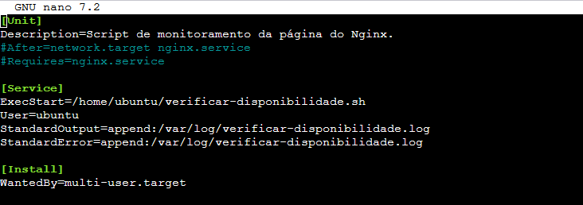

*Figura 8: Arquivo sentinela-nginx.service*

Esse serviço executa o script de verificar disponibilidade e salva o resultado que é printado no terminal no arquivo **verificar-disponibilidade.log**.

As linhas que estão comentadas na **Figura 8** representam uma falha de lógica que eu cometi durante o desenvolvimento da tarefa. Aquelas duas linhas dizem que o script só deve ser executado depois que o serviço do Nginx estiver funcionando corretamente, o que resultava no funcionamento incorreto do serviço sentinela, já que ele tentava iniciar o serviço do Nginx antes de executar e, portanto, o Nginx nunca estaria fora do ar quando esse serviço fosse executado. Dessa forma, a mensagem nunca era enviada para o Telegram.

Entretanto, somente isso não é o suficiente para executar o serviço a cada 1 minuto. Para que o serviço seja executado em um período de tempo definido, é necessário criar um arquivo **/etc/systemd/system/sentinela-nginx.timer**.

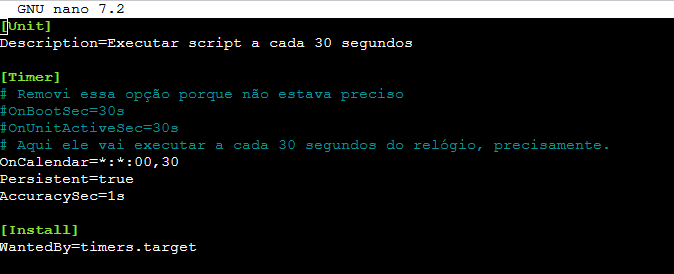

*Figura 9: Arquivo sentinela-nginx.timer*

As linhas que estão comentadas na **Figura 9** representam a primeira tentativa de fazer o serviço executar em um tempo específico. Entretanto, essa alternativa não tinha me agradado, devido ao fato de que ela não estava sendo executada a cada 30 segundos, então alterei para o código que está abaixo, que executa sempre que chegar nos 30 segundos de algum minuto.

A linha **`WantedBy=timers.target`** cria um link simbólico (quando o service `.timer` for habilitado com o `enable`) para a pasta que gerencia os arquivos `.timer` do sistema. Então, o sistema irá executar esses arquivos ao iniciar.

---

## Testando a solução

Se você seguiu os passos que eu fiz até aqui, você deve poder executar o teste conforme explicarei abaixo.

### Testando reinicialização do Nginx

Para verificar se a configuração de reinicialização do Nginx está funcionando corretamente, você deve terminar o processo de uma forma inesperada. Para isso, execute os comandos da seguinte forma:

**`ps aux | grep nginx | grep master`** -> Vai lhe fornecer o processo master do Nginx. Você irá utilizar o PID desse processo para o próximo passo, além disso, garante que o Nginx está rodando.

**`sudo kill -9 PID_DO_PROCESSO`** -> Isso vai finalizar o processo de uma forma inesperada. O `-9` significa forçar o término do processo.

**`sudo systemctl status nginx`** -> Vai exibir que o serviço está reiniciando (ou ativo se você demorar para executar).

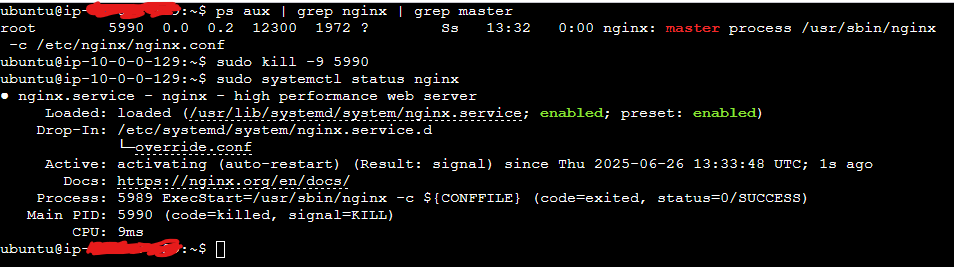
*Figura 10: Resultado dos comandos acima.*

Na **Figura 10**, você pode ver que o processo está "activating", que é o sinal de que ele foi finalizado e está iniciando novamente.

### Testando o script de verificar a disponibilidade

Não irei testar o script **`send-message.sh`** diretamente, já que ele é executado junto com o script **`verificar-disponibilidade.sh`**.

Para testar o serviço, vamos testar em partes, e depois testar tudo de uma vez só. Primeiramente, vou executar o script **`verificar-disponibilidade.sh`**. Para isso, irei para a pasta onde criei o arquivo. Na **Figura 11**, é possível ver que quando o serviço do Nginx está rodando, o script retorna que está tudo certo. Na **Figura 12**, é possível ver que o script alerta que o site está fora do ar.

#### Testando com o Nginx ativo

**`sudo systemctl status nginx`** -> Para verificar que o Nginx está ativo.

**`./verificar-disponibilidade.sh`** -> Para executar o script.

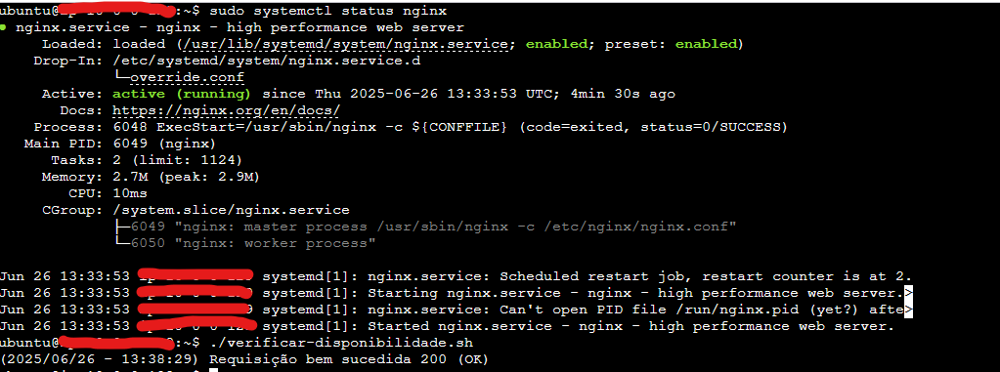
*Figura 11: Teste do verificar-disponibilidade.sh*

#### Testando com o Nginx desligado

**`sudo systemctl stop nginx`** -> Para o serviço da forma correta, não ativando o trigger de reiniciar o serviço automaticamente.

**`sudo systemctl status nginx`** -> Para verificar que o Nginx está desligado.

**`./verificar-disponibilidade.sh`** -> Para executar o script.
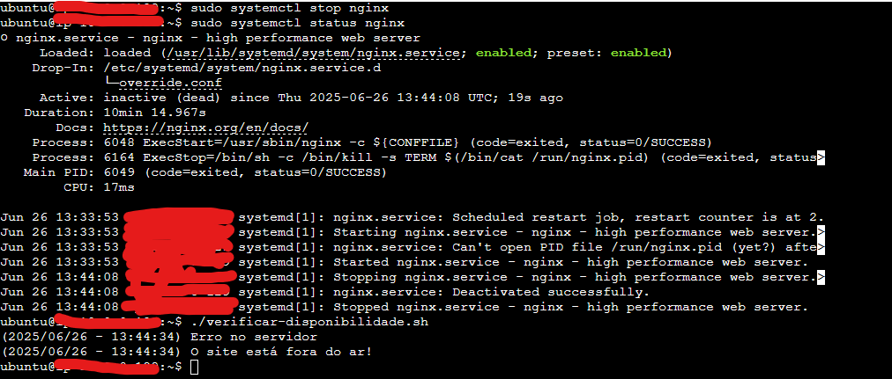
*Figura 12: Teste do verificar-disponibilidade.sh com Nginx desligado*

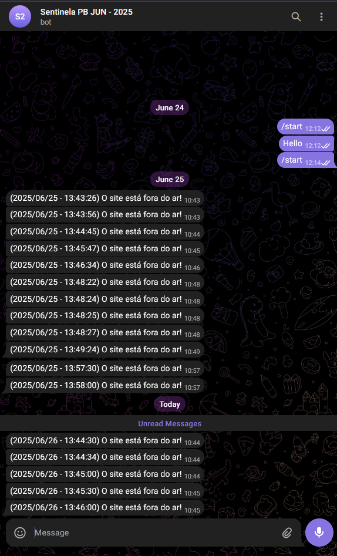
*Figura 13: Chat com as mensagens de alerta do estado do site.*

Na **Figura 13**, podemos ver as mensagens que são enviadas quando o script é executado e o sistema está fora do ar. A mensagem que é enviada no dia 26/06/2025 - 13:44:34 é resultante da execução manual que fiz, enquanto as outras são do serviço de automação, que executa a cada 30 segundos.

### Testando os serviços de execução/temporização

Se você criou os arquivos corretamente, você deve ser capaz de executar os seguintes comandos para ativar os serviços.

#### Testando o sentinela-nginx.service

**`sudo systemctl enable sentinela-nginx.service`** -> Esse comando vai criar o link simbólico que vai ativar o serviço para o systemctl.

**`sudo cat /var/log/verificar-disponibilidade.log`** -> Esse comando é para mostrar que o arquivo está vazio no momento.

**`sudo systemctl start sentinela-nginx.service`** -> Vai executar o serviço que por consequência vai executar o script **`verificar-disponibilidade.sh`**.

**`sudo cat /var/log/verificar-disponibilidade.log`** -> Agora o comando deve exibir o log do script.

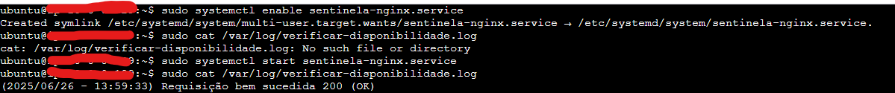
*Figura 14: Execução dos comandos para testar o sentinela-nginx.service.*

#### Testando o sentinela-nginx.timer

Para testar o timer, irei printar primeiramente o horário atual da máquina e então habilitar o serviço. Para isso, executei os seguintes comandos:

**`date +"%Y/%m/%d - %H:%M:%S"`** -> Printar o horário atual no terminal.

**`sudo systemctl enable sentinela-nginx.timer`** -> Ativa o serviço.

**`sudo systemctl start sentinela-nginx.timer`** -> Inicia o serviço.

**`sudo cat /var/log/verificar-disponibilidade.log`** -> Verificando o log para contar o número de vezes que o script foi executado.

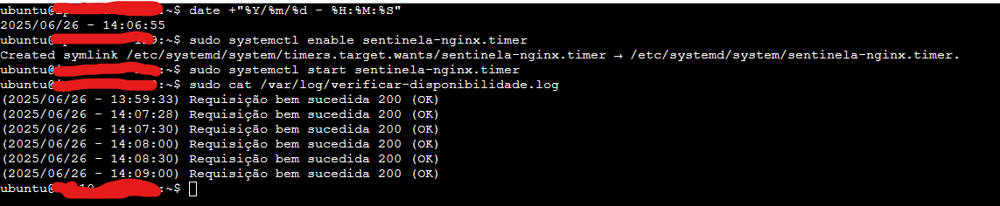
*Figura 15: Execução dos comandos para testar o sentinela-nginx.timer.*

---

## Conclusão

É possível criar diversos scripts para automatizar tarefas que são simples e criar serviços para garantir que essas tarefas são executadas conforme o esperado (seja em tempo ou em relação a requisitos). Além disso, é importante ressaltar que a possibilidade de sobrescrever configurações padrões de serviços facilita bastante o controle desses.

---

## Próximos passos!

Vou colocar essa página no GitHub e transformar esse arquivo em um `README.md`. Após isso, irei criar uma nova branch no repositório para fazer os desafios adicionais, visto que terminei essa tarefa com alguns dias de antecedência.