# Projeto Wordpress - PB JUN 2025

## Introdução

O objetivo desse projeto é implantar a plataforma WordPress com alta disponibilidade na AWS. Durante o projeto iremos usar as seguintes aplicações:
- Wordpress
- Docker

E usaremos os seguintes serviços da AWS:
- IAM Roles
- VPC
- RDS (Com MySQL)
- EFS
- Load Balancer
- Auto Scaling group
- EC2

## Etapa 0: Criação do perfil IAM

Para que a instância da EC2 possa montar o EFS, ela precisa ter permissão. Para isso, vamos criar uma função. Para isso, vá para IAM > Roles > Create Role. Selecione Trusted Entity Type: AWS Service e selecione EC2. 

Adicione um nome e finalize a criação sem adicionar permissões ainda, vamos adicionar uma inline depois.

Agora entre em IAM > Roles e procure a role que criamos agora, clique na role pra abrir ela. Depois, clique em add permissions e Create Inline Policy.

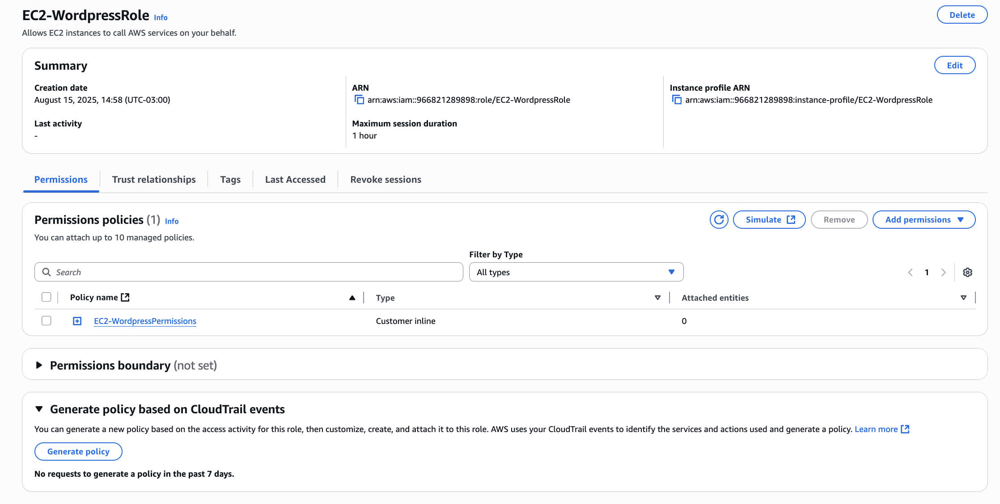

Ao entrar na página, selecione a edição por JSON e copie o conteúdo do arquivo inline-policy.json para dentro do editor. Vá para o próximo passo e coloque um nome adequado para a permissão.

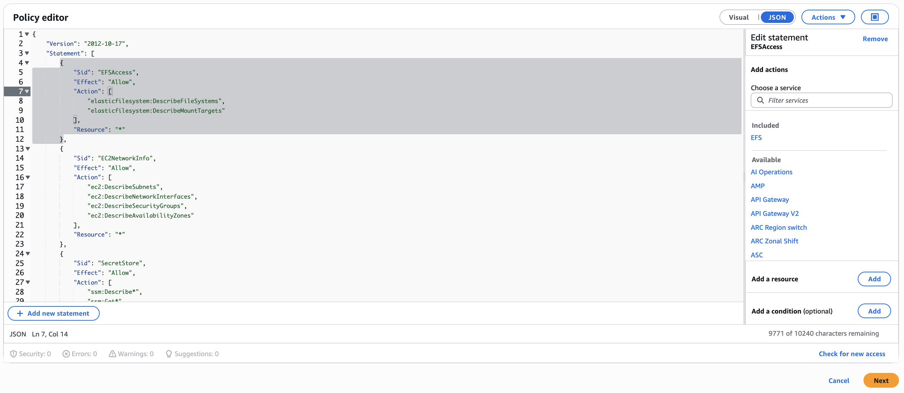

Agora estamos prontos para começar a implantar os serviços.

## Etapa 1: Criação e configuração da VPC

É necessário criar uma VPC com seis subnets, sendo quatro privadas e duas públicas. Para isso, entre no painel da AWS e procure por VPC. Entre no dashboard de VPC. Por hora, devemos deixar a opção de NAT gateway desativada, vou ativar mais pra frente para evitar custos adicionais enquanto fazemos as configurações básicas.

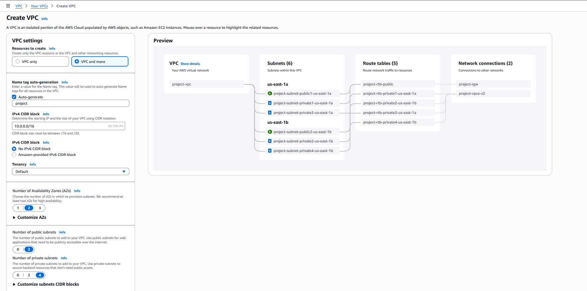

Para facilitar, iremos criar um security group para a EC2 (depois precisaremos criar mais alguns). Para isso, entre em VPC > Security > Security Groups. 

Crie um security group para uma instância bastion. Esse SG deve conter uma regra de entrada que permita ssh de qualquer fonte.

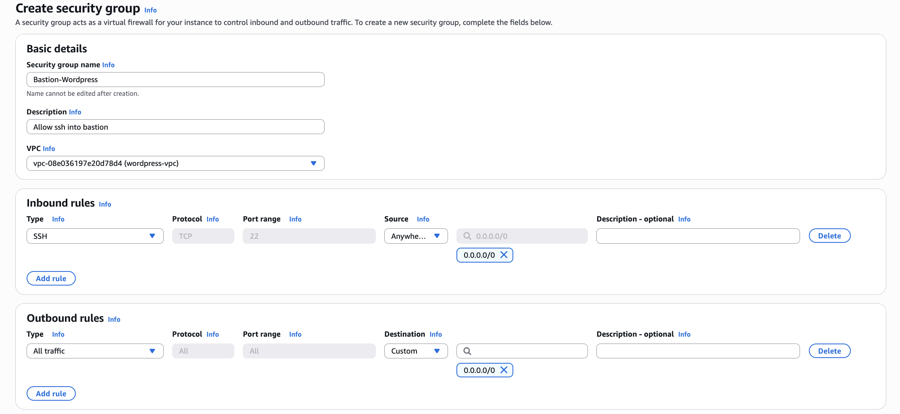

Agora iremos criar um SG para o load balancer. 

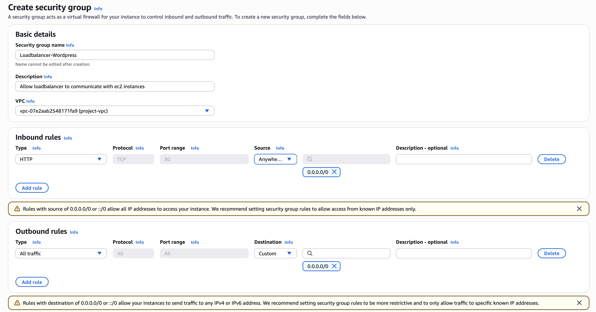

Crie um security group que permita a entrada de conexões por SSH da bastion group e HTTP do load balancer. A configuração final deve ficar conforme a imagem abaixo.

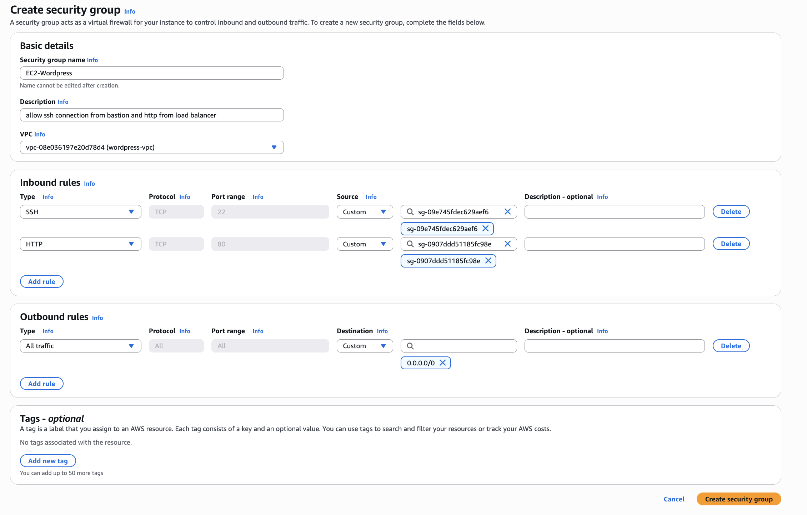

Após criar o SG da EC2, precisamos criar um SG para a EFS. Para isso, faça o mesmo processo do passo anterior e crie um SG com as propriedades da imagem abaixo.

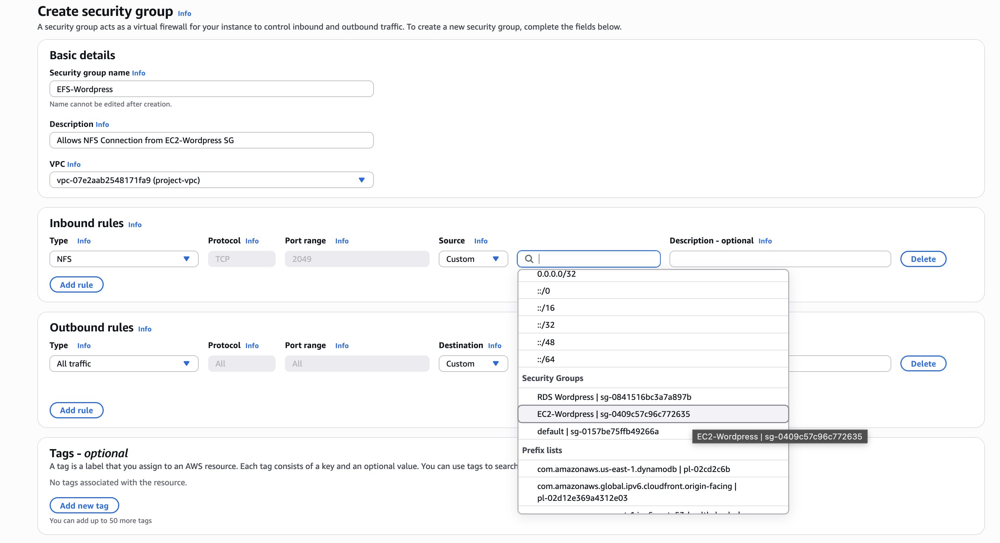

Além disso, é necessário criar o NAT Gateway para permitir que as instâncias da EC2 tenham conexão com a internet. Para isso, entre em VPC > NAT Gateway. Configure conforme a imagem abaixo. É importante que você coloque o NAT gateway em uma subnet pública. Além disso, é necessário alocar um IP elástico.

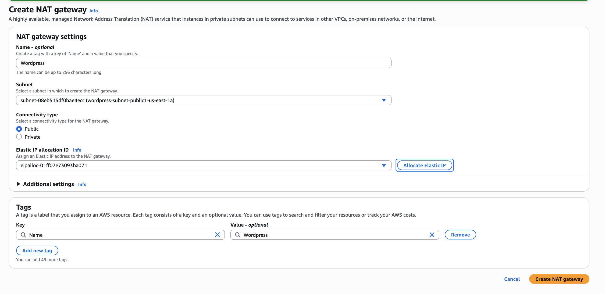

Após a criação do NAT Gateway, precisamos configurar as route tables para redirecionar as requisições das máquinas EC2 para o NAT Gateway. Para isso, vá para VPC > Route Tables e altere a route table das subnets 1 e 2 (as duas subnets privadas que terão as instâncias da EC2) para essa configuração:

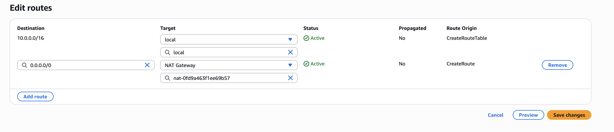

## Etapa 2: Criação do RDS

Antes de criar uma instância da RDS, é necessário criar um grupo de subnets, que é basicamente onde a instância estará disponível. Conforme o diagrama, a instância deverá estar em uma subnet privada isolada (selecione as duas subnets que restaram, as que não tem acesso a internet). Para isso, basta entrar no dashboard do RDS e selecionar Create DB Subnet Group. A AWS te obriga a criar em duas AZ diferente, portanto, terei de fazer uma sutil alteração do projeto do diagrama . Seu grupo deve ficar conforme a imagem abaixo.

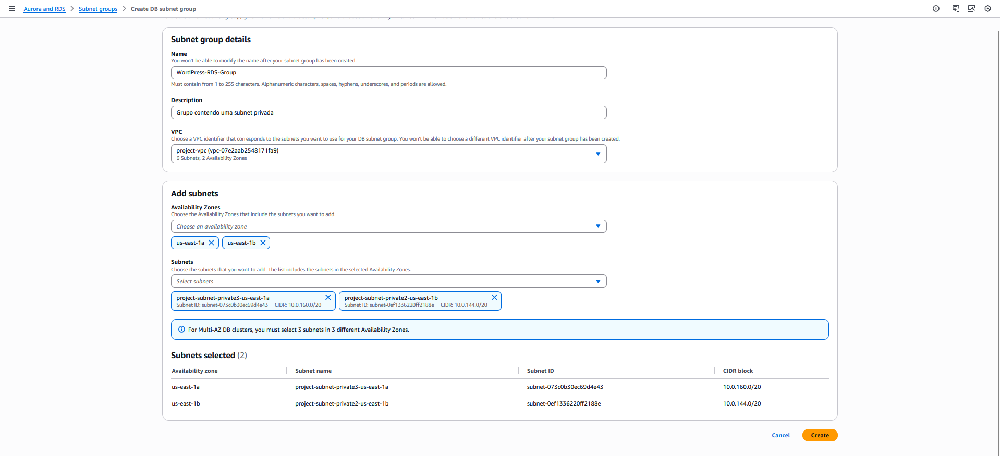

Após a criação do grupo, podemos criar o RDS. A configuração é bem simples, você deve ir para o dashboard Aurora e RDS, clicar na opção de criar um database. Na interface de criação, você deve selecionar a opção Standard create e a engine MySQL. Além disso, você deve selecionar a opção free tier. Como a tarefa pediu, selecionei a opção de single-AZ. Após isso, basta configurar as informações do banco de dados. É recomendado utilizar as seguintes variaveis:

- DB instance identifier: wordpress
- Master username: admin
- Master password: DbAtTesteProjeto2

Caso você decida alterar essas variáveis será importante alterar no docker-compose em um passo futuro, para garantir que o WordPress seja capaz de se conectar com o banco corretamente. Além disso, você deve usar uma instância do tipo db.t3.micro.

Após isso, você pode selecionar a VPC e o grupo que foram criados anteriormente. Selecione "No" para acesso público e crie um novo security group (depois iremos configurar as regras de entrada e saida dele). 

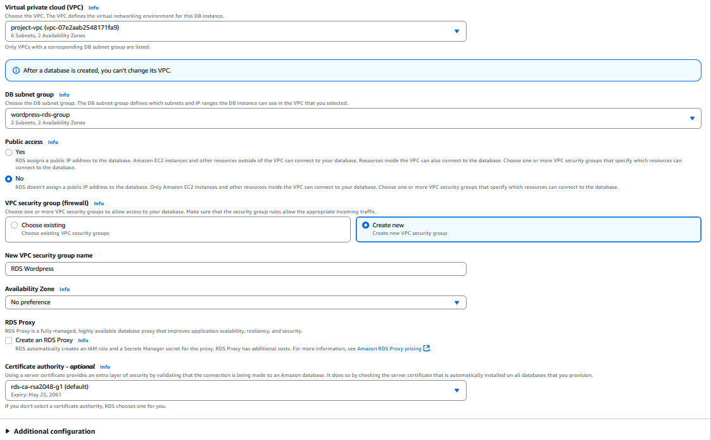

Além disso, você deve configurar o nome do database inicial. Para isso, você deve clicar na aba "Additional configuration" e em "Initial database name" inserir "wordpress".

Após criar o banco, precisamos configurar o security group do RDS. Para isso, vá para VPC > Security Groups e selecione o security group do RDS. Clique em edit inbound rules. Agora delete a regra de entrada e crie uma nova do tipo MYSQL/Aurora e coloque como fonte o security group do EC2.

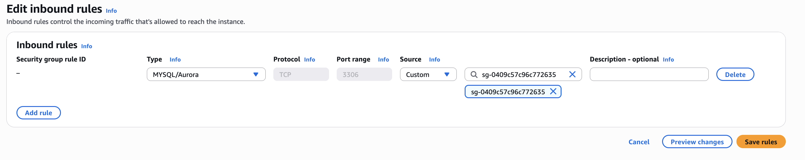

## Etapa 3: Criação do EFS

Para criar o EFS, você deve procurar na barra de pesquisa "EFS". Ao entrar na página, você deve clicar em Create File system e colocar o nome desejado (recomendo seguir o da imagem abaixo para evitar problemas). Selecione a VPC que foi criada anteriormente.

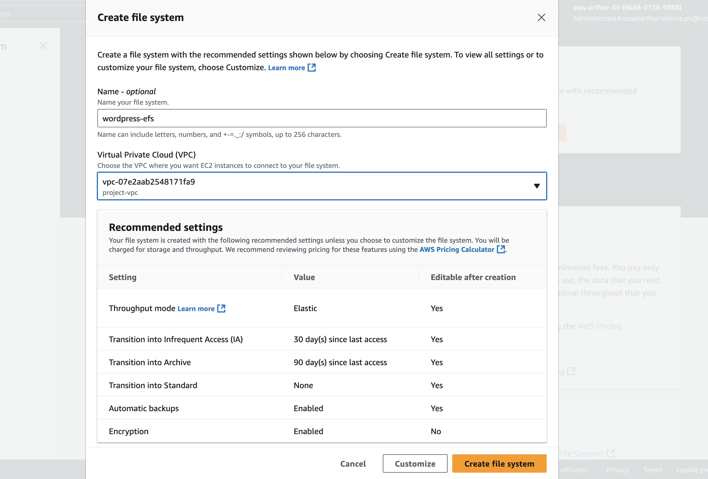

Após isso, devemos criar os mount targets em subnets privadas. Para isso, entre em Amazon EFS > File Systems e selecione o EFS que acabamos de criar. Ao selecionar o EFS, entre na aba de network e clique em manage. 

A Amazon cria automaticamente dois mount targets na criação da EFS. Devemos excluir esses mount targets e adicionar dois novos (Você precisa primeiro excluir, clicar em salvar e depois criar os novos mount targets, caso tente fazer tudo de uma vez resultará em erro). É importante selecionar duas AZ diferentes e as duas subnets devem ser as mesmas que foram selecionadas para o banco de dados.

Além disso, devemos selecionar o security group que criamos para o EFS mais cedo.

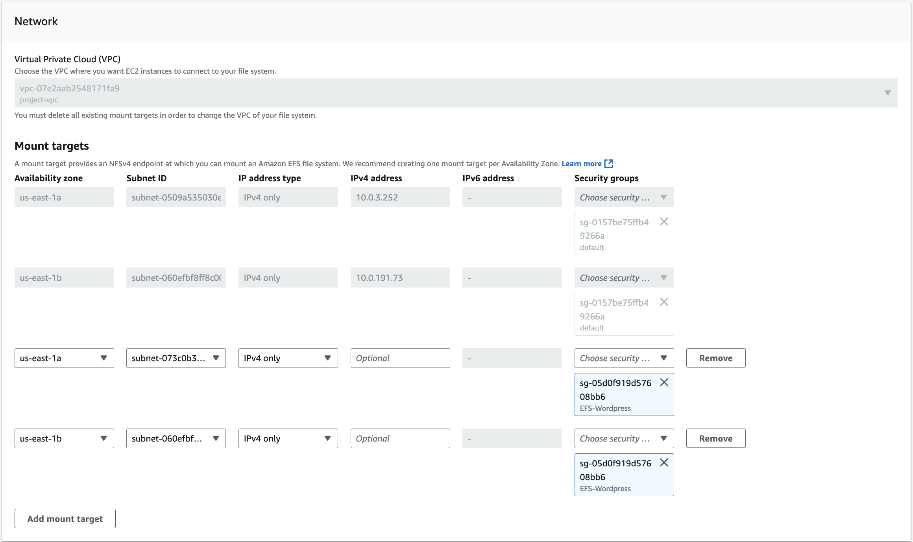

## Etapa 4: Criação do target group
Vamos criar o load balancer agora, pois precisamos do DNS do load balancer pra configurar corretamente o Wordpress (evitar problemas com DNS).

Antes de criar o load balancer, precisamos criar um target group. Para isso, vá em EC2 > Target Groups. Clique em criar target group.

Coloque um nome, a VPC criada e coloque a rota /health.html no health check path.

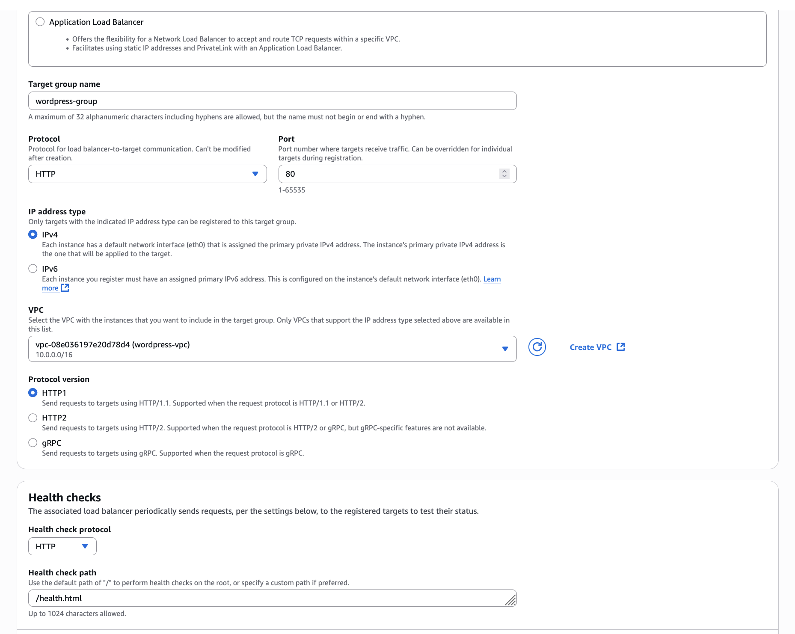

Vá para o próximo passo e finalize o target group (não selecione instância ainda).

## Etapa 5: Criação do load balancer

Entre em EC2 > Load balancers > Create load balancer. Selecione Application Load Balancer.

Adicione as configurações conforme a imagem abaixo para que o load balancer seja acessível pela internet.

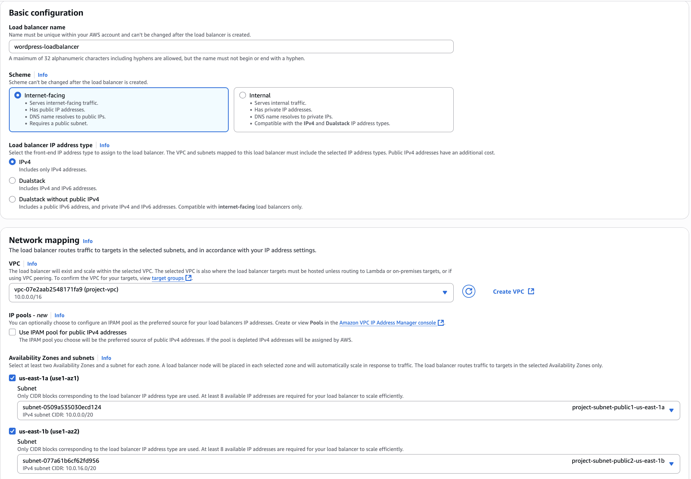

Além disso, adicione o SG e o target group que criamos antes.

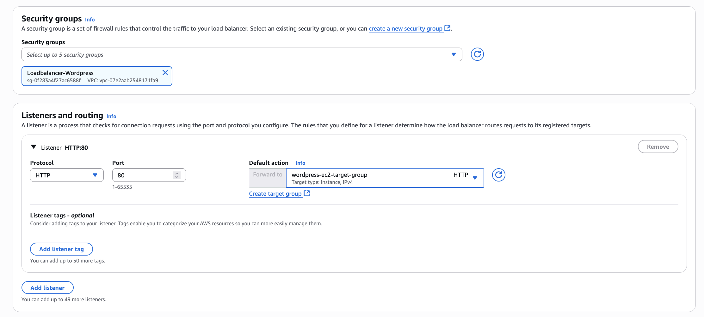

Por final, clique em criar load balancer.

Espere a finalização da criação do load balancer e copie o DNS dele. Você vai precisar disso para configurar o docker-compose.

## Etapa 6: Criação da EC2

Para criar as instâncias, decidi criar uma imagem que contenha o docker instalado e tudo configurado para facilitar o uso do autoscaling.

Você pode criar a instância bastion agora. Ela deve estar em uma subnet publica e ter uma chave SSH (idealmente a mesma que estará na instância que vai rodar o wordpress). Selecione o tipo de instância do free tier e você deverá ter tudo que precisa pra executar a instância bastion.

Para criar a imagem com o Wordpress e o EFS configurados, entre em EC2 > Instances > Launch an Instance. Selecione a imagem do Ubuntu (de preferência a mais recente). Insira uma chave SSH (de preferência a mesma da bastion) para permitir a conexão com a instância.

Por hora, vamos colocar essa instância em uma subnet pública, assim, poderemos fazer a configuração sem precisar de uma instância intermediária. Para isso, selecione a VPC que criamos e selecione uma subnet pública. Sua configuração deve ficar igual a imagem abaixo.

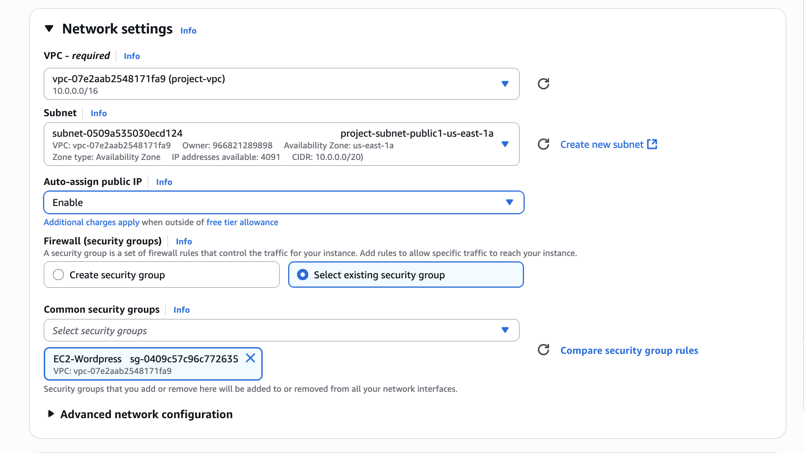

Insira o userdata.sh no campo do userdata na aws. É importante você substituir os dados do docker-compose que está dentro do user data pelos seus dados, principalmente o campo meu-loadbalancer-dns.

**NÃO ESQUEÇA DE ALTERAR AS VARIÁVEIS!!**
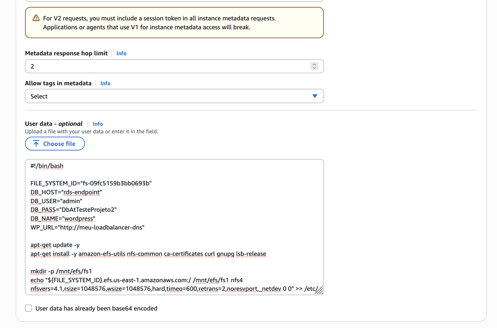

## Etapa 7: Criação da AMI

Agora que configuramos a máquina corretamente, podemos criar uma imagem baseada nessa EC2. Para isso, entre em EC2 > Instances e selecione a instância que fizemos as mudanças.

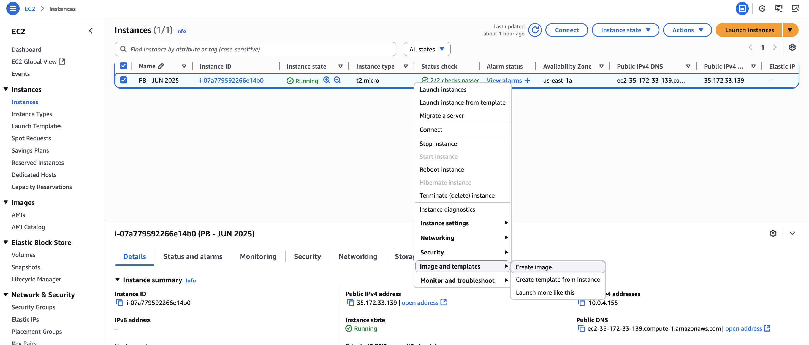

Após clicar, você preenche os dados para criar conforme a imagem abaixo. E clica em Create Image.

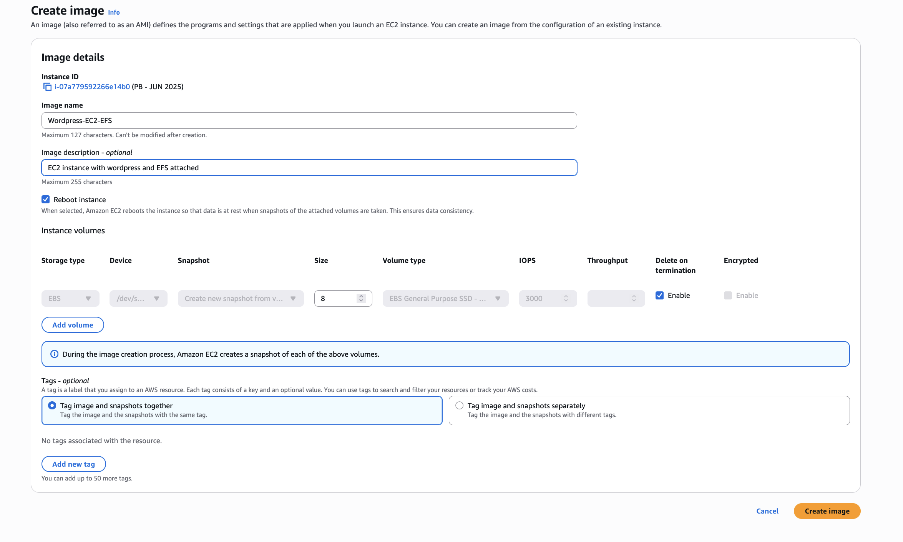

## Etapa 8: Criação do Launch Template.
Com a imagem em mãos, podemos criar um Launch Template. Entre em EC2 > Launch templates > Create launch template. Preencha com o nome e escolha a imagem que criamos no passo anterior.

Selecione o tipo de instância t2.micro. Além disso, coloque uma chave SSH (de preferência a mesma chave que você usou para configurar a bastion) para caso você precise fazer alguma alteração direto na máquina. Sua configuração deve ficar dessa forma:

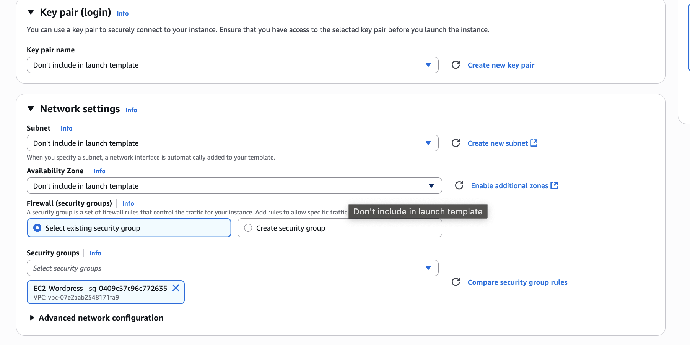

Por último, você deve associar a função que criamos na Etapa 0. Vá até o final da página e selecione em configurações adicionais.

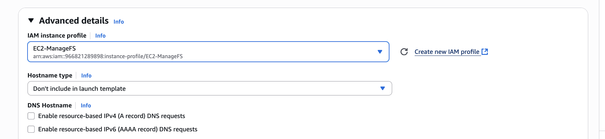
## Etapa 9: Criação do autoscaling group

Para criar o ASG, você deve entrar em EC2 > Auto Scaling groups > Create Auto Scaling group. Preencha com um nome e selecione o template que criamos no passo anterior. Clique em próximo.

Você deve selecionar a VPC do projeto e as duas subnets privadas que não estão sendo utilizadas pelo EFS e RDS.

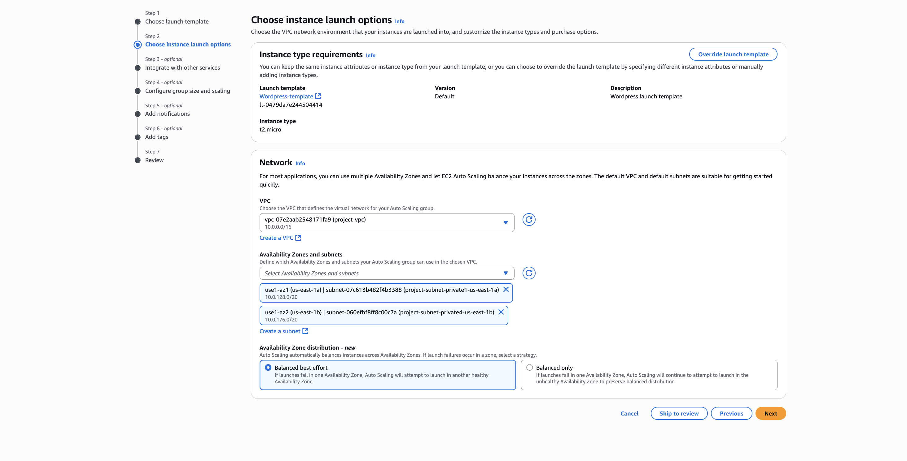

Após isso, vá para o passo 3 e anexe o ASG ao load balancer que criamos anteriormente.

Você pode ir para o passo 4. Lá você irá configurar a scaling policy, onde o iremos definir o mínimo de instâncias como 2 e o máximo como 3. Além disso, precisamos configurar a política de scaling para uso da CPU. Nesse caso, configurei para 70%.

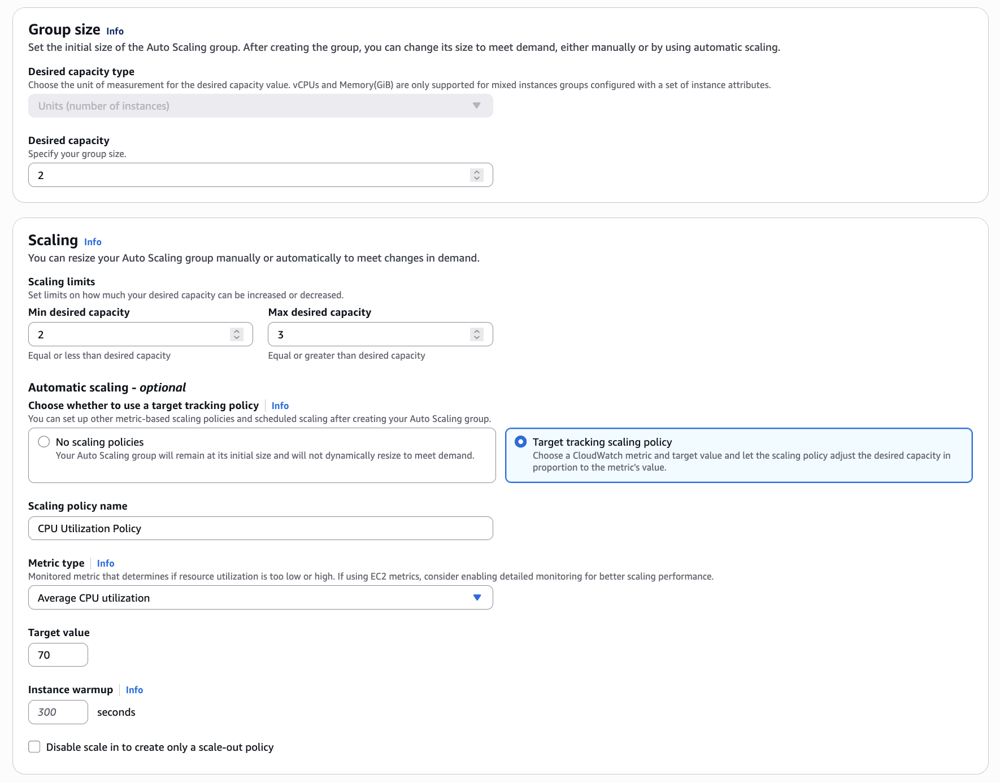

Por fim, clique em ir para revisão e finalize a criação do ASG.

## Etapa 10: Teste!

Para testar se sua infraestrutura está funcionando, você deve acessar o DNS do load balancer. Se tudo estiver funcionando, o site do wordpress deverá aparecer lhe dando a opção de criar uma conta.

## Considerações finais

Apesar de não ter todos os recursos que são recomendados (Route 53, Multi-AZ no db e outros), essa estrutura é bem robusta e pode servir muito bem para projetos de teste ou até mesmo pequena escala. Além de funcionar bem, terá alta disponibilidade e flexibilidade para expandir no futuro. O projeto foi desafiador, mas muito interessante e pude colocar na prática os conceitos que aprendi anteriormente.